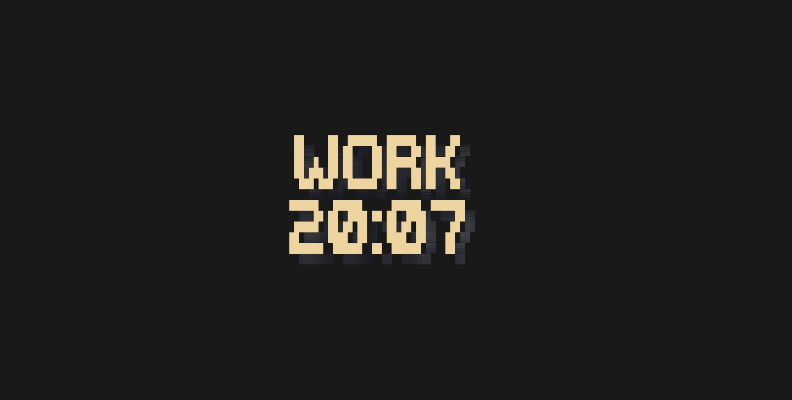

<div align="center">

# Pomodoro CLI



**A sleek, distraction-free Pomodoro timer built for the terminal.**

[](https://golang.org/)
[](LICENSE)
[](https://github.com/spf13/cobra)
[](https://github.com/c4rl0s04/pomodoro-cli/actions/workflows/ci.yml)

</div>

---

### The Terminal is Your Focus Zone.

Pomodoro CLI is a lightning-fast, highly aesthetic command-line application that implements the Pomodoro technique directly in your terminal. It leverages a custom 3D shadow rendering engine and an alternate screen buffer to hide all distractions, leaving you with nothing but a beautiful, massive digital clock.

## Key Features

* **3D Retro Styling:** A custom-built rendering engine creates a stunning drop-shadow effect for a premium, retro-digital aesthetic.
* **Desktop Notifications:** Native cross-platform system alerts and sounds when a timer completes.
* **Zero Distractions:** Takes over the terminal buffer, hiding command history and prompts until your session ends.
* **Intelligent Cycles:** Automatically transitions between Work, Short Break, and Long Break phases.
* **Persistent Configuration:** Built-in Viper integration allows you to save your perfect timer settings to a YAML file.
* **Strict Architecture:** Cleanly decoupled Go architecture separating core timer logic from presentation.

---

## Getting Started

### Prerequisites

* Go 1.18 or higher

### Downloading Pre-compiled Binaries (Easiest)

If you don't have Go installed, you can simply download the latest pre-compiled binary for your operating system (Mac, Linux, or Windows) from the **[Releases](https://github.com/c4rl0s04/pomodoro-cli/releases)** tab on GitHub.

1. Download the archive for your OS.
2. Extract the `pomodoro-cli` executable.
3. Move it to your system's PATH (e.g., `/usr/local/bin/pomodoro-cli`).

### Building from Source

1.  Clone the repository to your local machine:
    ```bash
    git clone https://github.com/c4rl0s04/pomodoro-cli.git
    cd pomodoro-cli
    ```

2.  Build the executable using the provided Makefile:
    ```bash
    make build
    ```
    This will generate an executable file named `pomodoro-cli` in the root of the project directory.

### Using Docker

If you don't want to install Go on your system, you can run the CLI entirely through Docker!

1. Build the Docker image:
   ```bash
   docker build -t pomodoro-cli .
   ```

2. Run the Docker container (Note: the `-it` flag is required for the terminal UI to render correctly):
   ```bash
   docker run -it pomodoro-cli start
   ```

---

## Usage Guide

Dive straight into a focus session using the default 25-minute timer:

```bash
./pomodoro-cli start
```

### Viewing Statistics

Curious how productive you've been this week? Use the stats command to see a beautiful 3D bar chart of your completed focus sessions!

```bash
./pomodoro-cli stats
```

### Advanced Configuration

Tailor the intervals to match your exact workflow using command-line flags (all values in minutes):

```bash
./pomodoro-cli start --work 50 --short-break 10 --long-break 30 --cycles 4
```

* `--work` (`-w`): Duration of the focus block.
* `--short-break` (`-s`): Duration of the short rest period.
* `--long-break` (`-l`): Duration of the extended rest period.
* `--cycles` (`-c`): Number of focus blocks before a long break.

### Interactive Controls

While the timer is running, you can use the following keyboard shortcuts:
* `Spacebar`: Pause / Resume the timer
* `n`: Skip to the next phase (e.g. end a break early)
* `q` (or `Ctrl+C`): Gracefully quit the application

### Persistent Settings

Tired of typing flags? Create a `.pomodoro.yaml` file in your home directory (`~/.pomodoro.yaml`):

```yaml
work: 50
short-break: 10
long-break: 30
cycles: 4
```

The CLI will automatically detect this file and apply your custom settings on every run.

---

## Under the Hood

The architecture is strictly modularized for scalability and testability:

* `core/pomodoro/`: The pure business logic. A deterministic countdown engine that emits tick events.
* `ui/`: The presentation layer. Subscribes to tick events and handles complex pterm matrix manipulation.
* `cmd/`: The Cobra entry point bridging flags, configuration, and execution.

### Developer Commands

* `make run`: Compile and execute immediately.
* `make test`: Run isolated unit tests for the core engine.
* `make lint`: Run `golangci-lint` to enforce strict formatting standards.

---

<div align="center">
    <i>Built with focus.</i>
</div>
